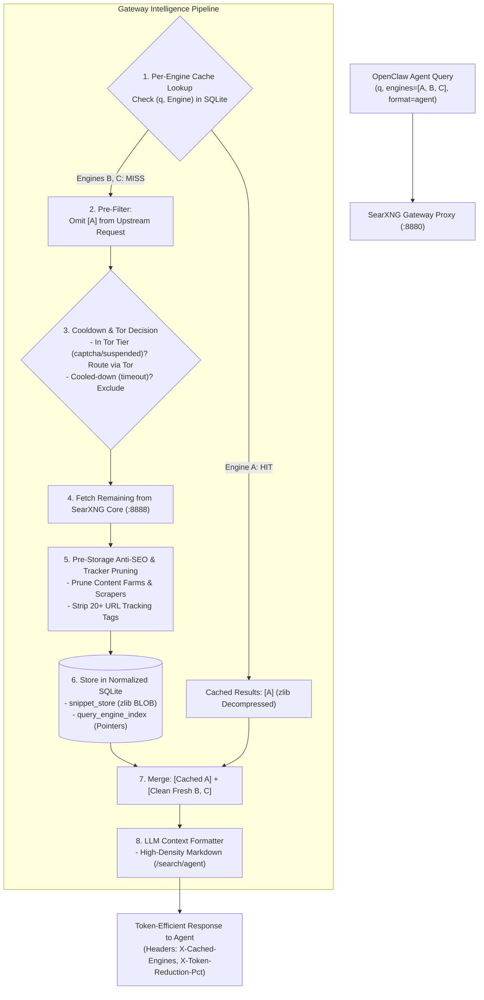

<div align="center">


# SearXNG

**SearXNG** is a free, privacy-respecting [metasearch engine](https://en.wikipedia.org/wiki/Metasearch_engine). Users are neither tracked nor profiled.

[](https://github.com/searxng)
[](https://docs.searxng.org)
[](https://github.com/searxng/searxng/blob/master/LICENSE)
[](https://github.com/searxng/searxng/commits/master/)
[](https://translate.codeberg.org/projects/searxng/)

</div>

---

## ⚡ OpenClaw Rate-Protection, Caching & Gateway Extension

This repository includes the **SearXNG Gateway & Rate Protection Engine** designed specifically for [OpenClaw](https://github.com/openclaw/openclaw) agents and local LLM search pipelines.

It provides a high-throughput, non-LLM reverse proxy gateway sitting in front of SearXNG to protect upstream rate limits, cache snippets in a normalized database, prune SEO spam, format high-density context for LLMs, and selectively route blocked engines through Tor circuits.

---

## 🌟 Major Features & Improvements

### 1. Deterministic Rate Protection & Dynamic Cooldown Filtering
- **Deterministic Cooldown Tiers**: Automatically applies non-LLM rate throttling based on SearXNG response feedback: `suspended` (180s), `captcha` (60s), `timeout` (300s), `access_denied` (3600s).
- **Exponential Escalation & Degraded Protection**: $2^{\text{consec}-1}\times$ multiplier per consecutive failure; escalates to $\ge 3600\text{s}$ if an engine fails $\ge 3$ times within a 24-hour sliding window (capped at 24h).
- **Reset-on-Success & Client Immunity**: Automatically clears active cooldowns and failure counts on the first responsive search; never penalizes external engines on internal client network/system errors.
- **Dynamic Pre-Filtering**: Strips cooled-down engines from incoming multi-engine search requests to protect upstream rate limits and avoid wasted requests.

### 2. Per-Engine Cache with Upstream Pre-Filtering
- **Granular Per-Engine Caching**: Results are cached and indexed per `(query, engine, category)` tuple.
- **Upstream Pre-Filtering**: The gateway checks the local cache *before* issuing upstream network queries. If an engine's results are already cached, that engine is omitted from the upstream SearXNG query, slashing response latency to **< 2ms** and conserving rate limits.
- **Transparent Merging**: Automatically merges cached snippets with fresh results into a single deduplicated response.

### 3. Normalized Content-Addressable Storage with `zlib` Compression
- **Zero Redundant Storage**: Uses a normalized schema (`snippet_store` + `query_engine_index`) where unique sanitized URLs are stored exactly once across all queries and engines.
- **Internal `zlib` BLOB Compression**: Encodes snippet text into binary BLOBs using Python's built-in `zlib` (level 6), achieving an **85.5% net database storage reduction**.
- **100% Client Transparency**: Compression is purely internal to SQLite; OpenClaw always receives standard uncompressed JSON or Markdown.

### 4. Pre-Storage Anti-SEO Domain Filtering & Tracker Stripping
- **Content Farm Blocklist**: Prunes low-quality SEO content farms (`geeksforgeeks.org`, `javatpoint.com`, `quora.com`, etc.) via `domain_blacklist.txt` with wildcard subdomain matching (`*.spamdomain.com`).
- **Scraper Link Heuristics**: Automatically detects and prunes search aggregator mirrors (`/search?q=`, `/find/`) and affiliate wrappers (`/out/link`, `?aff=`).
- **20+ URL Tracking Parameter Stripping**: Sanitizes URLs by stripping `utm_*`, `ref`, `ref_src`, `fbclid`, `gclid`, `msclkid`, `spm`, `session_id`, `aff_id`, and `campaign_id`.
- **Pre-Storage Pipeline**: Pruning executes *before* writing to SQLite, keeping local database records pristine.

### 5. Token-Optimized LLM Response Formatter
- **Dedicated Agent Endpoints**: Access via `/search/agent`, `format=agent` (high-density Markdown), `format=agent_markdown`, or `format=agent_json` (compact JSON).
- **Text Normalization**: Decodes HTML entities (`&amp;`, `&#39;`, `&quot;`) and removes residual HTML tags (`<b>`, `<em>`, `<mark>`).
- **Context Window Savings**: Delivers **27% to 70% prompt token reduction** compared to raw SearXNG JSON responses.

### 6. Selective Tor Proxy Routing
- **Dynamic Circuit Promotion**: Automatically routes engine queries through a Tor SOCKS5 proxy (`--tor-proxy`) when an engine enters `captcha`, `access_denied`, or `suspended` tiers rather than dropping the engine.
- **Configurable Routing**: Support for static Tor-routed engines (`--tor-engines`) and configurable trigger tiers (`--tor-tiers`).

### 7. Asynchronous Idle Duplicate Verification & BLOB Dropping
- **Zero Real-Time Latency**: Candidate semantic duplicates are returned immediately to OpenClaw (zero search delays, zero false positives) and logged in `duplicate_candidates`.
- **Idle Sweep Consolidation**: Background worker (`searxng_duplicate_verifier.py`) evaluates candidate pairs via HTTP 301/302 redirects and body text similarity.
- **BLOB Deletion**: Repoints all query index pointers to the canonical URL and **completely deletes duplicate BLOBs from disk**.

---

## 🏗 Architecture Overview



---

## 🚀 Gateway Quick Start

### 1. Launch Gateway Proxy
```bash
python3 tools/searxng_gateway.py \
    --port 8880 \
    --upstream http://localhost:8082 \
    --db tools/searxng_engine.db \
    --blacklist-file tools/domain_blacklist.txt \
    --tor-proxy "socks5://127.0.0.1:9050" \
    --tor-tiers "captcha,access_denied,suspended"
```

### 2. Search Endpoints
- **Standard Search**: `GET http://127.0.0.1:8880/search?q=python+asyncio&format=json`
- **Agent Markdown Context**: `GET http://127.0.0.1:8880/search/agent?q=python+asyncio`
- **Compact Agent JSON**: `GET http://127.0.0.1:8880/search?q=python+asyncio&format=agent_json`
- **Force Fresh Results (Bypass Cache)**: `GET http://127.0.0.1:8880/search?q=python+asyncio&fresh=1`
- **Gateway Telemetry & Cooldown Status**: `GET http://127.0.0.1:8880/gateway/status`

### 3. Run Maintenance & Engine Probes
- **Probe All Engines**: `python3 tools/searxng_engine_probe.py --run "manual-check" -v`
- **Display 24h Engine Latencies ($p50/p95$)**: `python3 tools/searxng_engine_probe.py --metrics`
- **Scheduled Daily Maintenance**: `bash tools/searxng_daily_sweep.sh -v`

---

## 📖 Upstream SearXNG Documentation & Setup

- **Installation Guide**: [docs.searxng.org/admin/installation.html](https://docs.searxng.org/admin/installation.html)
- **Configuration Guide**: [docs.searxng.org/admin/settings/index.html](https://docs.searxng.org/admin/settings/index.html)
- **Community Chat**: [#searxng:matrix.org](https://matrix.to/#/#searxng:matrix.org)
- **Contributing**: See [CONTRIBUTING.rst](CONTRIBUTING.rst)
- **License**: GNU Affero General Public License (AGPL-3.0). See [LICENSE](LICENSE).
